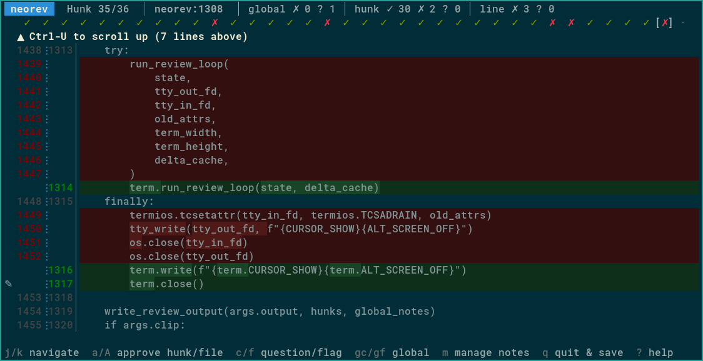

# neorev

**_Human review for agent diffs_**

TUI tool optimized for efficient review of code produced by coding agents.

Pipe diff from `git` or `jj` to `neorev`, view and annotate hunks, then send the output text directly to the agent:

```bash
git diff | neorev review.txt
claude -p "@review.txt"
```

## Features

- Simple terminal UI optimized for efficiency
  - compact view to comfortably read diffs
  - keyboard navigation & control
- Review annotations can be:
  - tied to a line, a hunk, or global
  - request for change or question
- Minimal solution:
  - single file, no external Python dependencies
  - rely on [`delta`](https://github.com/dandavison/delta) for diff formatting and coloring
  - rely on your editor to write annotations
- Quit and resume review without losing state
- Review output:
  - can be pasted directly in agent terminal
  - is unambiguous to reduce back and forth
  - is concise to reduce context window usage

Main screen:


## Why

This tool may be for you if you use coding agents, but want to keep control of code quality by reviewing every line of code **carefully** and **efficiently**.

Efficiently here means that :

- **you** should view and process the diff, jump between hunks and files quickly, flag hunks or add questions naturally
- **the agent** should process the review **unambiguously** and understand which actions are required, to minimize round trips

Agents are not like humans. They don't need you to be nice or polite, in fact studies have proven this degrades their output. They however may be eager to change code when you were in fact just asking a question. Also their context window can fill up quickly after several rounds of review. Code review tools made for humans just don't cut it here.

## Install

Install [delta](https://github.com/dandavison/delta) (you haven't already, seriously?), ensure you have a recent Python version, download [`neorev`](https://raw.githubusercontent.com/desbma/neorev/master/neorev) from this repository, make it executable and you are ready to go.

```bash
curl https://raw.githubusercontent.com/desbma/neorev/master/neorev -o neorev
chmod +x ./neorev
```

## Usage

1. Pipe any unified diff into `neorev` with an output file:

```bash
git diff HEAD~1 | neorev review.txt
jj show XXX | neorev review.txt
```

2. Navigate and annotate hunks in the TUI:

```
j / ↓         Next hunk
k / ↑         Previous hunk
Ctrl-D        Scroll diff down (half page)
Ctrl-U        Scroll diff up (half page)
a             Approve hunk (no comment needed)
A             Approve all hunks in current file
c             Add question (hunk or line target, opens $EDITOR)
f             Add flag / request change (hunk or line target, opens $EDITOR)
gc            Add global question (not tied to a specific hunk, opens $EDITOR)
gf            Add global flag / request change (not tied to a specific hunk, opens
              $EDITOR)
m             Manage notes (edit / delete)
q / Ctrl-C    Quit and write output to file
?             Show help
```

3. Send the output to the agent

Pasting `@review.txt` in the agent window is all that is required. Since the output is unambiguous any additional message like "please process the attached review" is a pure waste of tokens and your time typing it.

Pass `-c`/`--clip` to `neorev` to copy the message for the agent (`@OUTPUT`) to clipboard (requires `xclip`).

## Example of workflow with [Jujutsu](https://github.com/jj-vcs/jj)

1. Create an empty commit, this will be your **vetted** code: `jj new -m "feat: add feature foo"`
2. Create another empty commit on top of it, this will be the code **under review**: `jj new`
3. Prompt the agent to start work
4. When the agent is done:
   - `jj show | neorev -c /tmp/review.txt`
   - if code fully meets expectations: `jj squash`, the end
   - if code partially meets expectations: `jj squash -i` to squash the good parts into the vetted commit
5. Send `@/tmp/review.txt` to the agent, go to 4

Notes :

- you can stack another commit on top of the "under review" one, to track a round of changes, or to narrow down the review on a specific aspect
- using Jujutsu [workspaces](https://docs.jj-vcs.dev/latest/cli-reference/#jj-workspace), you can do that on several trees simultaneously without disrupting work

## License

[GPLv3](https://www.gnu.org/licenses/gpl-3.0-standalone.html)
